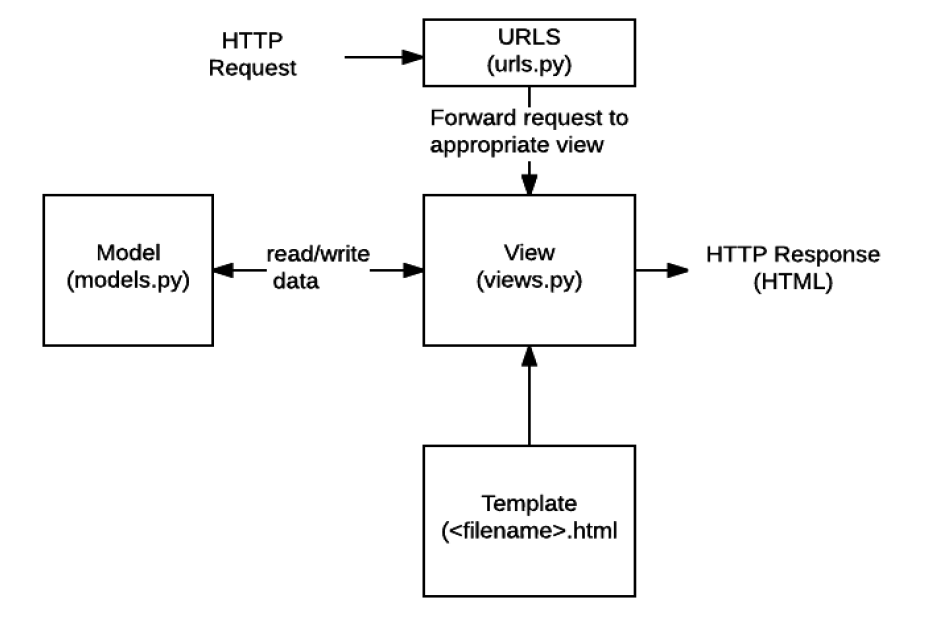

# Django


## 1. 정의

- Django : high-level Python Web Framework
  - Web Framework : 웹 페이지를 개발하는 과정 framework 제공. 데이터베이스 연동, 템플릿 형태의 표준, 세션 관리, 코드 재사용 등의 기능 포함

- Django의 MTV(Model-Templates-View) Pattern
  - Framework Architecture - MVC(Model-View-Controller) Design Pattern
    - Model : 응용프로그램의 데이터 구조를 정의하고 데이터베이스의 기록 관리(추가, 수정, 삭제)
    - Template(<=> MVC의 view) : 파일의 구조나 레이아웃 정의, 실제 내용을 보여주는 부분
    - View(<=> MVC의 controller) : HTTP 요청 수신 및 응답 반환, Model을 통해 받은 요청을 위해 필요한 데이터 접근, Template에게 응답 전달




## 2. Project 구조

- 기본 구조

  ```
  mysites
  ├───manage.py
  └───mysite
  		__init__.py
          asgi.py
          settings.py
          urls.py
          wsgi.py

- asgi.py
  - Asynchronous Server Gateway Interface
  - django 어플리케이션이 비동기식 웹 서버와 연결 및 소통하는 것을 도움
- settings.py : 어플리케이션의 모든 설정 포함

- urls.py

  - 사이트의 url과 적절한 views의 연결 지정
  - http 요청을 알맞은 view로 전달

- wsgi.py

  - Web Server Gateway Interface
  - django 어플리케이션이 웹서버와 연결 및 소통하는 것을 도움

- manage.py ; django 프로젝트와 상호작용 하는 커맨드라인 유틸리티

  ```powershell
  $ python manage.py <command> [options]
  ```


## 3. Applications 구조

- 일반적으로 application 명은 복수형

- 기본구조

  ```	
  polls
  ├── migrations
  |       __init__.py
  ├── __init__.py
  ├── apps.py
  ├── admin.py
  ├── models.py
  ├── tests.py
  └── views.py
  ```

- admin.py : 관리자용 페이지 설정

- apps.py : 앱의 정보 작성

- models.py : 앱에서 사용하는 Model 정의

- tests.py : 프로젝트의 테스트 코드 작성

- views.py 

  - view 함수들의 정의
  - http 요청을 수신하고 응답을 반환하는 함수 작성
  - Model을 통해 요청에 맞는 필요 데이터에 접근
  - HTTP 응답서식은 Templates를 통해 

- Templates/[app_name]/ : 새로 생성해야 함
  - 실제 내용을 보여주는데 사용되는 파일
  - 파일의 구조나 레이아웃 정의(Ex. html)
  - 일반적으로 최상위 폴더에 templates의 base.html을 상속하여 작성


## 4. 기본 사항

- 프로젝트는 어플리케이션의 집합 (collections of apps)

- 어플리케이션(앱)은 실제 요청을 처리하고 페이지를 보여주고 하는 등의 역할을 담당

- 하나의 프로젝트는 여러 앱을 가짐

- 일반적으로 앱은 하나의 역할 및 기능 단위로 작성

- INSTALLED_APPS

  - 항상 APPS 먼저 생성 후 settings에 등록
  - Local apps > Third party apps > Django apps 순서로 등록

  

## 5. DTL(Django Template Language)

- django template에서 사용하는 built-in template system

- Variable, Filters, Tags, Comments 등으로 구성

  ```django
  {{ variables }}   # varialbes
  {{ variables|lower }}   # filters
     # tags
     # tags2
  {# comments #}   # comments
     # comments2
  
  # EX.
  {{ name.0 }}
  {{ title|truncatewords:5 }}
  ```

  


