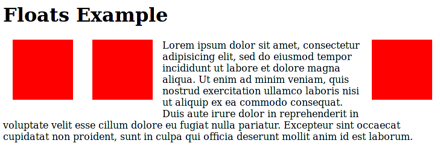

# CSS - display

## 1. Display & Flex box

- display 속성

  - 블록(block) 요소
    - 항상 새로운 라인에서 시작하며, 해당 라인의 모든 너비 차지
    - Ex. div, h1, p, ul, ol, form etc.
  - 인라인(inline) 요소
    - 새로운 라인에서 시작X, 해당 HTML 요소의 내용만큼의 너비만 차지
    - width, height, margin-top, margin-bottom 지정 X
    - Ex. span, a, img, input, label etc.
  - inline-block
    - 요소 자체는 인라인(inline) 요소처럼 동작, 요소 내부에서는 블록(block) 요소처럼 동작
    - 너비, 높이, 여백 지정 가능
  - none 
    - 해당 요소를 화면에 표시하지 않음 
    - 차지하는 공간 자체 X
    - visibility : hidden은 해당 요소를 화면에 표시하지 않지만 공간은 차지

- Flex box (Flexible box layout)

  - Flex container를 설정하고 내부의 Flex items의 크기를 유연하게 조절 가능

  - 요소 간 공간 배분과 정렬 기능을 위한 1차원 레이아웃

  - 콘텐츠를 감싸는 부모 요소에 flex 속성 지정 (display: flex)

  - flex-direction

    - row ; 기본값, 왼쪽에서 오른쪽

    - row-reverse ; 오른쪽에서 왼쪽

    - column ; 수직으로 위쪽에서 아래쪽

    - column-reverse ; 수직으로 아래쪽에서 위쪽

      

  - flex-wrap

    - nowrap ; 기본값, flex 항목들이 wrap 되지 않도록 지정

    - wrap ; flex 항목들이 container 내부에서 여러 줄로 열 바꿈할 수 있도록 허용

    - wrap-reverse ; wrap으로 생기는 정렬이 반대 방향으로

      

  - flex-flow

    - flex-direction과 flex-wrap의 값을 명시하는 단축 속성
    - 두 개의 인자를 순서에 상관없이 지정할 수 있고, 둘 중 하나 생략 가능

  - justify-content

    - flex 항목들의 main 축 정렬

    - flex-start ; 기본값, flex 항목들이 container의 시작 부분으로 정렬

    - flex-end ; flex 항목들이 container의 끝 부분으로 정렬

    - center ; 중앙 정렬

    - space-between ; 첫 번째 항목은 시작부분, 마지막 항목은 끝 부분으로 정렬하고 남은 공간에 일정한 간격으로 분배하여 정렬

    - space-around ; 좌우 균등 정렬(내부 요소 여백이 외곽 여백의 2배)

    - space-evenly ; 균등 정렬(내부 요소 여백과 외각 여백이 동일)

      

  - align-items

    - flex 항목들의 cross 축 정렬

    - stretch ; 모든 flex 항목들이 서로 일치(높이값이 container의 높이와 동일)하도록 조정

    - flex-start ; flex 항목들의 container의 윗 부분에 위치하고 각 항목의 높이는 flex 항목에 따라 결정

    - flex-end ; flex 항목들이 container의 아래 부분에 위치하고 각 항목의 높이는 flex 항목에 따라 결정

    - center ; 위 아래 잔여 공간이 동일하게 flex 항목을 중앙에 배열

    - baseline ; flex 항목의 기준선을 중심으로 정렬. 기준선은 각 항목마다 다를 수 있음

      

  - align-self

    - 개별 flex 항목에 적용하는 속성

    - 정렬 방식은 align-items와 동일

    - 기본값은 auto

      

  - align-content

  - flex-grow

    - flex 항목의 넓이를 정의하는 속성

    - main 축에서 남은 공간을 flex-grow에 설정된 값의 비율 만큼 분배

      

  - order

    - 기본값 0, 작은 숫자일수록 앞으로 이동

## 2. Position

- position
  - static (기본값)
    - top, right, bottom, left 속성 값에 영향을 받지 않음
    - 웹 페이지의 흐름에 따라 차례대로 요소들을 위치시키는 방식
    - 부모 내에서 배치되는 경우 부모 요소의 위치를 기준으로
  - relative
    - HTML 요소의 기본 위치(자기 자신의 static 위치)를 기준으로 이동
    - 요소가 차지하는 공간은 static인 경우와 동일
  - absolute
    - 해당 요소의 바로 상위의 위치가 설정된 조상(ancestor) 요소(static이 아닌 요소)를 기준으로 위치를 설정 (없는 경우 HTML 문서의 body 요소 기준)
    - 페이지의 다른 요소의 위치와 간섭히자 않는 격리된 사용자 인터페이스 기능을 만드는데 활용
      - Ex. 팝업 정보 상자, 제어 메뉴 etc.
    - 요소가 공간을 차지하지 않음
  - fixed
    - 뷰포트(viewport)를 기준으로 위치를 설정하는 방식
    - 웹 페이지가 스크롤 되어도 고정 위치로 지정된 요소는 항상 같은 곳에 위치
    - 요소가 공간을 차지하지 않음

## 3. Float

- float

  - 웹 페이지의 레이아웃을 작성할 때 주로 사용
  - float: left, right
    - float 속성 지정
  - clear: both
    - float 속성을 적용하고자 하는 요소가 모두 등장한 이후에는 clear 속성을 사용하여, 이후에 등장하는 요소들이 float 속성에 영향을 받지 않도록 설정
  - overflow: auto
    - float 속성이 적용된 HTML 요소가 자신을 감싸고 있는 컴테이너 요소보다 클 때 컨테이너 요소의 크기가 자동으로 내부의 요소를 감쌀 수 있을 만큼 크기를 조정

  
